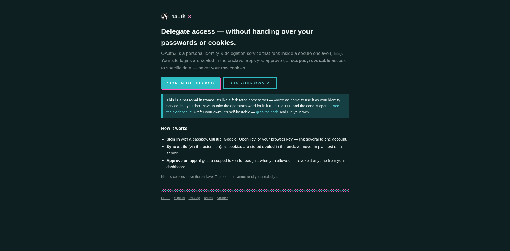
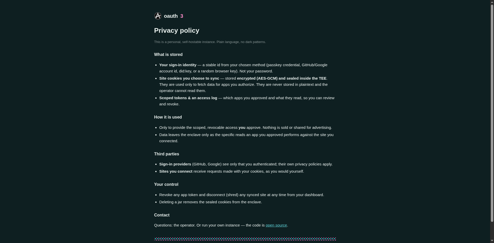
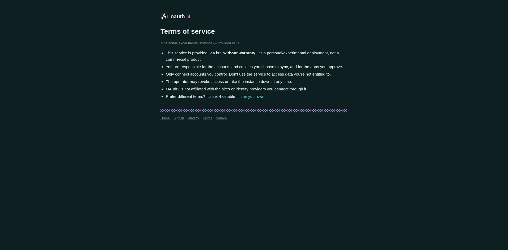
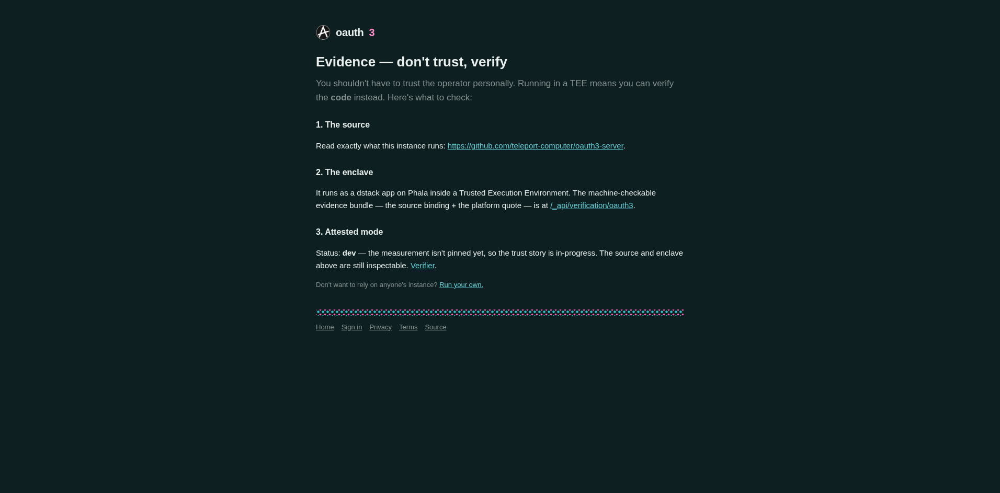

# Tier-2 runtime walk — issue #58, 2026-07-15

Re-verification of all three `## Acceptance` items on **deployed staging**, this pass with the PNG
step screenshots that the 2026-07-14 pass could not capture (the envoy/neko screenshot tool is
working again — see `flow.md` "Resolution" section).

- **Driven via:** the real envoy/neko Brave bridge at `http://localhost:3000/api/bridge` (no
  CDP/Playwright — per LESSONS). Serialized with `flock /tmp/envoy-bridge.lock` (shared browser).
- **Deployed node:** `$WEBHOST_STAGING/oauth3` (resolved from
  `~/projects/oauth3-apps/.staging-env`) → `https://…-8080.dstack-pha-prod7.phala.network/oauth3`.
- **Deployed commit:** `69843a8` (per `GET /oauth3/_api/version`). `3855f2c` (PR #62, the #58
  design restyle) is an ancestor of it, so the design-system code is live.

## Item 1 — `deno check server/home-page.ts server/design.ts`  →  exit 0 (clean)

## Item 2 — no `#4f46e5` in shell pages (source + runtime)
- source: `grep -rn '4f46e5' server/home-page.ts server/design.ts` → 0 hits
- runtime, in the real browser, on every page: `indigoInDOM` (the rendered `outerHTML` searched for
  `#4f46e5`) = **false**; indigo `rgb(79,70,229)` scan across all elements' computed color/bg/border
  = **none**.

## Item 3 — evidence page still live-fetches status
`#att-status` resolves from `"checking the live verifier…"` → **`dev`** (the page's runtime
`fetch('/_api/verification/oauth3')` runs and updates the DOM; 404 by design → dev-mode branch,
attestation tracked in #32). The restyle did not break the live-fetch.

## Per-step results (this pass)

| page | path | nav (href asserted) | `#4f46e5` in DOM | `--paper` token | body bg | screenshot |
|---|---|---|---|---|---|---|
| 01-home | `/` | OK | absent ✅ | `#0e1f21` | `rgb(14,31,33)` | `01-home.png` |
| 02-privacy | `/privacy` | OK | absent ✅ | `#0e1f21` | `rgb(14,31,33)` | `02-privacy.png` |
| 03-terms | `/terms` | OK | absent ✅ | `#0e1f21` | `rgb(14,31,33)` | `03-terms.png` |
| 04-evidence | `/evidence` | OK | absent ✅ | `#0e1f21` | `rgb(14,31,33)` | `04-evidence.png` |

h1 texts captured: home *"Delegate access — without handing over your passwords or cookies."* ·
privacy *"Privacy policy"* · terms *"Terms of service"* · evidence *"Evidence — don't trust,
verify"*.

### Screenshots

